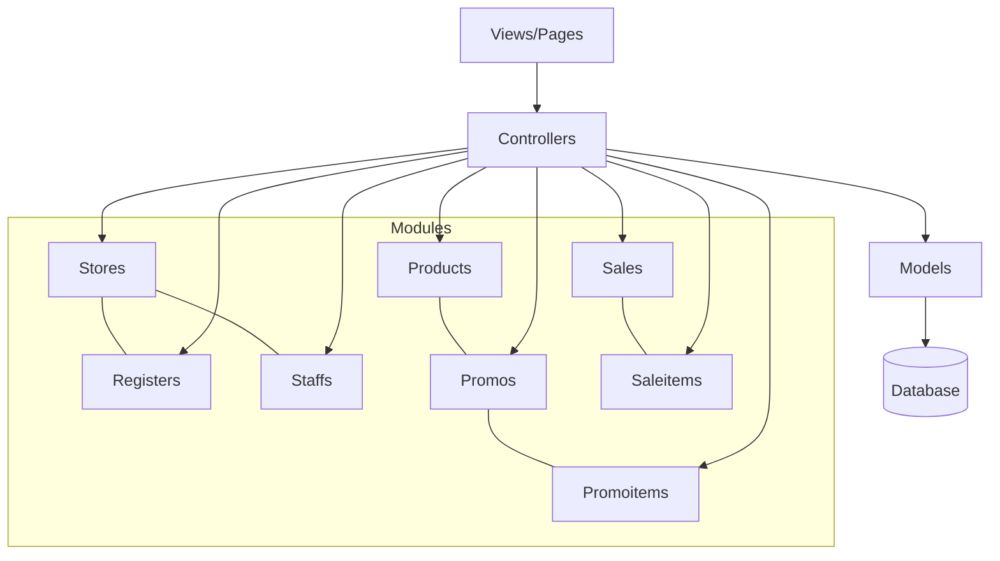
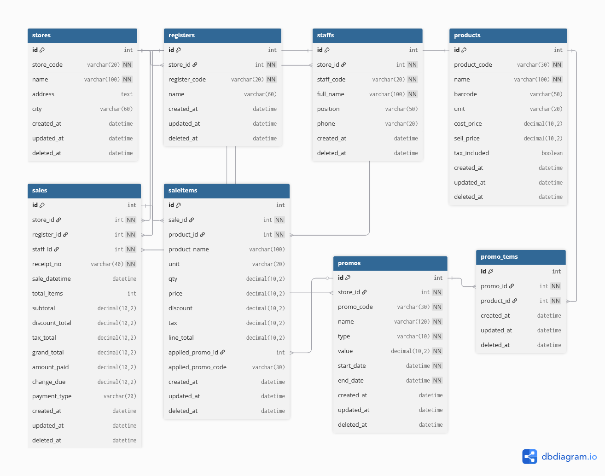

# CI4 Retail POS

Aplikasi Point of Sale (POS) berbasis CodeIgniter 4 untuk mengelola toko, kasir (register), staf, produk, promo, dan penjualan.

Gambar struktur, ERD, dan panduan menjalankan ada di bawah. Kamu juga bisa menaruh screenshot/diagram tambahan di `docs/images/` dan README ini sudah menautkannya.

## Fitur

- Manajemen toko, register, staf, dan produk
- Setup promo dan item promo (buy X get Y, dsb.)
- Pencatatan penjualan dan detail item
- Laporan penjualan sederhana
- API kecil untuk kebutuhan front-end (eligible promo, dsb.)

## Teknologi

- CodeIgniter 4.2.11 (PHP ^7.4 || ^8.0)
- Composer (dependency manager)
- Database: MySQL/MariaDB (disarankan)

## Struktur Proyek

```text
app/
  Config/
  Controllers/
    Dashboard.php, Stores.php, Products.php, Staffs.php,
    Registers.php, Promos.php, Promoitems.php, Sales.php, Reports.php
  Database/
    Migrations/  (skema tabel)
    Seeds/       (data awal)
  Models/
    StoreModel.php, RegisterModel.php, StaffModel.php,
    ProductModel.php, PromoModel.php, PromoitemModel.php,
    SaleModel.php, SaleItemModel.php
  Views/
    layouts/, dashboard/, stores/, products/, staffs/,
    registers/, promos/, promoitems/, sales/, reports/
public/
vendor/
```

## Diagram Arsitektur (Mermaid)



Gambar ERD:



## Cara Menjalankan

Prasyarat:

- PHP ^7.4 / ^8.0 dengan ekstensi: intl, mbstring, json
- Composer terpasang
- Database MySQL/MariaDB siap (buat database kosong, misal: `ci4_pos`)

Langkah:

1) Clone & install dependency

```bash
git clone <repo-url> ci4-retail-pos
cd ci4-retail-pos
composer install
```

2) Salin file env dan atur konfigurasi

```bash
cp env .env
```

Edit `.env` minimal untuk database (contoh):

```
database.default.hostname = localhost
database.default.database = ci4_retail_pos
database.default.username = root
database.default.password = 
database.default.DBDriver = MySQLi
app.baseURL = 'http://localhost:8080/'
```

3) Jalankan migrasi dan seeder

```bash
php spark migrate
php spark db:seed DatabaseSeeder
```

4) Jalankan server pengembangan

```bash
php spark serve
```

Akses: `http://localhost:8080` (dashboard) atau lihat rute di bawah.

## Rute Utama

- `/` dan `/dashboard` → Dashboard
- `/stores`, `/products`, `/staffs`, `/registers` → CRUD master data
- `/promos`, `/promoitems` → Setup promo
- `/sales` → Penjualan (index, create, show)
- `/reports` → Laporan
- API: `/api/promos/eligible`, `/api/registers/by-store`, `/api/staffs/by-store`

Detail rute lihat `app/Config/Routes.php`.

## Migrasi & Seeder

Migrasi (skema utama):

- `Stores`, `Registers`, `Staffs`, `Products`, `Promos`, `Promoitems`, `Sales`, `Saleitems`

Seeder (data awal):

- `DatabaseSeeder` memanggil: `StoreSeeder`, `ProductSeeder`, `StaffSeeder`, `RegisterSeeder`, `PromoSeeder`, `PromoItemSeeder`, `SalesSeeder`

Jalankan ulang dari nol (opsional, hati-hati data hilang):

```bash
php spark migrate:refresh
php spark db:seed DatabaseSeeder
```

## Perintah Spark Berguna

- `php spark migrate` — menjalankan migrasi
- `php spark migrate:rollback` — rollback batch terakhir
- `php spark migrate:refresh` — reset & jalankan ulang semua migrasi
- `php spark db:seed DatabaseSeeder` — seeding data awal
- `php spark serve` — server dev lokal

## Troubleshooting

- Composer tidak ada: install Composer dari getcomposer.org
- Ekstensi PHP (intl/mbstring) belum aktif: aktifkan di `php.ini`
- Port 8080 terpakai: jalankan `php spark serve --port 8081`
- Koneksi DB gagal: cek `.env` dan kredensial DB
